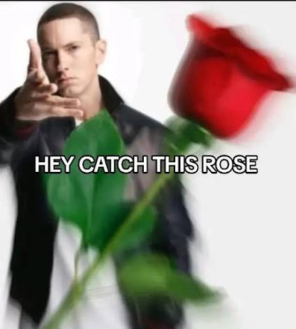

  <h1><b>🚀 Hey, It's Me Kaptan Danuj | Welcome To GitHub 
</b></h1>
  
<em>"Hesitation Is Defeat!!!"</em>

  
  <!-- High Quality Ezgif Local File -->
  

    

  <!-- GTA 4 Banner Image -->
  

 

  <b>🔹 Core Areas (Languages):</b> `Java` • `Python` • `C++` • `JavaScript` 
  <b>🔹 Backend & DB:</b> `Spring Boot` • `MySQL` • `Hibernate` • `H2-console` 
  <b>🔹 Tools & Platforms:</b> `Git` • `Docker` • `VS Code`

---

  <!-- GitHub Stats Card without rank ring -->
  
  
  <!-- Niko Bellic Image (Spaces encoded as %20) -->
  
  
  <!-- Top Languages Card -->
  

 

  

 

  

